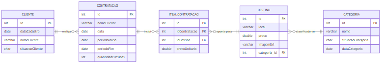
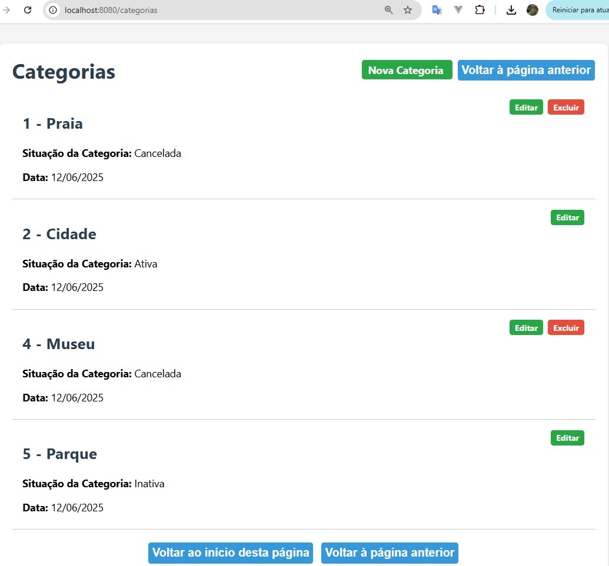
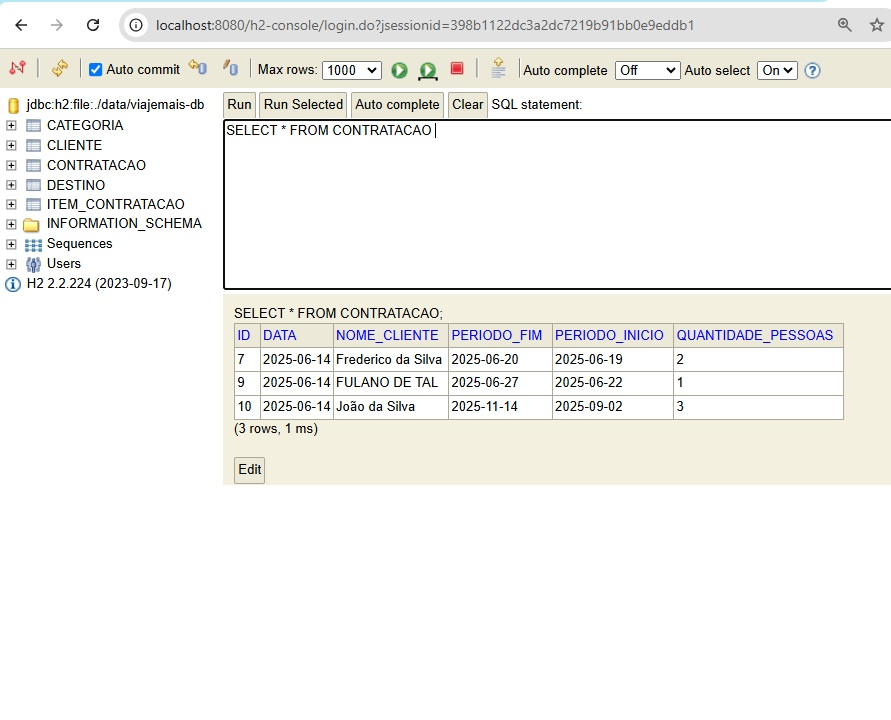

#  ViajeMais - Projeto Experimental de viagens de turismo

#### Aplicação Spring Boot para gestão de destinos, clientes e contratações de viagens.

## Principais Funcionalidades
##### Cadastro de Clientes
  - Criar, editar (situação) e excluir (apenas clientes cancelados).   
  - Nome único, validações de formato e tamanho.
  
##### Gestão de Destinos
  - CRUD completo de destinos (Local, Categoria, Preço, URL de imagem).   
  - Preço em formato brasileiro (1.234,56 ou 1234), 
    com validação estrita e valor mínimo de R$ 1,00.
  - Exclusão condicionada a não haver contratacões vinculadas.

    
##### Categorias de Destino
  - CRUD de categorias (nome único, situação, data).    
  - Relação N:1 entre Destino → Categoria.
  - Excluir apenas categorias canceladas.
    
##### Confirmação de Viagem
  - Seleção de destinos, autocomplete de cliente, validações de cliente,
    número de pessoas e período de datas (início ≥ corrente, 
    fim ≥ início, duração ≤ 90 dias).
      
      
##### Histórico de Contratações
  - Cálculo de diárias, preço por diária, valor total (incluindo Qt. Pessoas).
  - Edição de período/quantidade e exclusão apenas para viagens futuras.

#     
## Banco de Dados H2 em disco
  - Persistência em arquivo (jdbc:h2:file:…),
    carregamento inicial via CommandLineRunner com opção de reload.
  - Sequences reiniciáveis para IDs começando em 1.

# 
## Modelo de Dados (ERD)
    Gerado via https://mermaid.live com src/main/resources/static/docs/viajemais.mmd 

##  

##  

 
# 
## Tecnologias

##### Java 17, Spring Boot, Spring Data JPA, Thymeleaf
##### H2 Database, Maven
##### SLF4J + Logback, Bean Validation (JSR-303)

# 
## Como Executar

1. Clonar o repositório
2. git clone https://github.com/FranciscoCLira/viajemais.git
3. cd viajemais
4. Configurar se quiser recarregar dados (application.properties):
5. app.reload-data=true  # ou false para manter dados existentes
6. Construir e iniciar:
7. mvn clean package
8. mvn spring-boot:run
9. Acessar no navegador:
   - Home: http://localhost:8080/   
   - H2 Console: http://localhost:8080/h2-console (URL JDBC em application.properties)

# 
## Páginas web principais e IDE 

##### IDE - restart app localHost 

  
##### Home e Selecinar Viagens 

  
##### Confirmação de Viagem 

  
##### Histórico da Confirmação de Viagem 

  
##### Histórico de Contratações  

  
##### Editar Contratação 

  
##### Excluir Contratação 

 
##### Categorias

 
##### Nova Categoria

##### Editar Categorias

##### Destinos
)

##### Novo Destino

##### Editar Destino

##### Novo Cliente

##### Clientes Cadastrados 

# 
## DB H2: 
 
##### H2 DB Console Login 

  
##### CLIENTE 

##### CATEGORIA 

##### DESTINO  

##### CONTRATACAO 

##### ITEM_CONTRATACAO 

                                                    
                                               
        
__________________________________________________________________________
Este README sintetiza o histórico de implementações e correções do projeto “ViajeMais”, agora pronto para uso e evolução contínua.

# 
## Autor
   Francisco Casemiro Lira
    
   https://www.linkedin.com/in/franciscoclira

